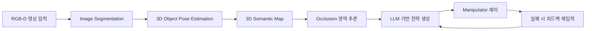

# LM_project_ver1.0

**언어 모델 기반 관측 불가능한 물체 탐색 방법**  
_지역지능화혁신인재양성사업 창의자율과제_  

---

##  프로젝트 개요

- **사업명**: 지역지능화혁신인재양성사업
- **센터명**: 숭실대학교
- **과제명**: 언어 모델(Language Model) 기반 관측 불가능한 물체 탐색 방법
- **연구기간**: 2025.07.01 ~ 2025.12.31


###  연구팀

| 역할 | 이름 | 과정 | 비고 |
|------|------|------|------|
| 팀장 | 정재훈 | 석사과정 1학기 |
| 팀원 | 오재홍 | 학부과정 8학기 | 
| 팀원 | 지어진 | 학부과정 7학기 | 
| 팀원 | 주진주 | 학부과정 6학기 | 

---

##  연구 배경 및 필요성

현대 로봇 시스템은 정적인 시야 내 객체 인식에는 뛰어난 성능을 보이지만, 물체가 시야에서 사라지거나 가려지는 상황에서는 인지 실패나 행동 정지를 유발합니다. 특히 **실내 환경**이나 **비정형적 작업 환경**에서 이러한 한계는 실제 활용 가능성을 저해합니다.

###  문제의식

- **Occlusion 문제**: 로봇이 물체를 시야에서 놓치는 순간, 인식 실패로 처리되어 작업 중단
- **현실적 대응 필요**: 물체가 보이지 않아도 존재 가능성을 고려한 판단 및 조작이 필요
- **기존 연구의 한계**: 정적인 시점 기반 인식 시스템에 집중되어 있음
- **해결 방향**: 다중 시점의 누적 인식과 언어 모델을 활용한 의미 기반 추론의 결합

---

##  연구 목표

> **"로봇이 보이지 않는 물체의 존재를 추론하고, 전략적으로 탐색하여 조작할 수 있도록 하는 통합 인지-조작 프레임워크 개발"**

###  주요 기술 목표

1. 시맨틱 분할 기반 객체 인식
2. 3D 객체 위치 및 자세 추정 (pose estimation)
3. 은닉 물체 추론을 위한 시각-언어 통합 인지 구조 개발
4. 언어 모델 기반 작업 전략 생성 및 행동 제어
5. 능동적 viewpoint 이동 및 반복 피드백 루프 설계

---

##  시스템 아키텍처



##  프로젝트 마일스톤 진행 현황

GitHub Issues 기반 마일스톤 트래킹은 아래 링크에서 확인하실 수 있습니다:

---

 [🔗 LM_project.ver1.0 마일스톤 목록 보기](https://github.com/jack0682/lm_project_ver1.0/milestones)

각 마일스톤에는 해당 기간의 목표, 완료된 이슈, 진행 중인 작업이 포함되어 있습니다.


---

#  GitHub 협업 매뉴얼 (Ubuntu 22.04 + ROS2 Humble 개발 환경 기준)

*LM\_project.ver1.0 팀 전용 Git 사용법*

---

##  목적

* 팀원 간 소스코드 협업을 Git + GitHub를 통해 구조화합니다.
* 로컬에서 개발한 후, GitHub에서 브랜치 → PR → 머지 과정을 안전하고 일관되게 진행할 수 있도록 가이드합니다.
* 모든 팀원이 동일한 Git 작업 방식으로 프로젝트를 운영하도록 합니다.

---

##  0. 사전 준비

###  1. GitHub 계정 생성

* [https://github.com/](https://github.com/) 에서 **본인 이름으로 GitHub 계정** 생성
* 프로필 사진, 닉네임 등은 본인 확인이 가능한 형태로 설정

###  2. Git 설치 확인 (Ubuntu 22.04 기준)

```bash
sudo apt update
sudo apt install git
git --version  # 설치 확인
```

###  3. SSH Key 등록 (GitHub 인증용)

```bash
# SSH Key 생성
ssh-keygen -t ed25519 -C "your_email@example.com"
# 생성된 키 확인
cat ~/.ssh/id_ed25519.pub
```

* 출력된 내용을 GitHub → Settings → SSH and GPG keys → New SSH key에 붙여넣기

---

##  1. 프로젝트 처음 받기 (Clone)

```bash
cd ~/ros2_ws/src
git clone git@github.com:jack0682/LM_project_ver1.0.git
cd LM_project_ver1.0
```

```bash
# 본인 이름으로 새 브랜치 만들기 (처음 1회만)
git checkout -b feature/홍길동-initial
```

---

##  2. 브랜치 전략 및 용어

| 브랜치명            | 용도                        |
| --------------- | ------------------------- |
| `main`          | 최종 안정 버전 (리더만 머지 가능)      |
| `develop`       | 개발 통합 브랜치 (모든 기능 통합 전 실험) |
| `feature/이름-기능` | 각자 작업 공간. 여기에만 푸시 가능      |
| `hotfix/이름-수정`  | 버그 수정용 브랜치 (급할 때만)        |

---

##  3. 작업 흐름 요약 (개발자 루틴)

###  A. 브랜치 생성 (처음 작업 시작할 때)

```bash
git checkout develop
git pull origin develop
git checkout -b feature/홍길동-추적기연동
```

###  B. 작업하고 커밋하기

```bash
# 파일 수정 후
git add .
git commit -m "[추적기] Panoptic 연동 기능 구현"
```

###  C. 브랜치에 푸시하기

```bash
git push origin feature/홍길동-추적기연동
```

---

##  4. Pull Request(PR) 보내기

1. GitHub 웹사이트 접속 → 본인 브랜치 클릭
2. `Compare & Pull Request` 클릭
3. 제목: `[기능명] 어떤 기능을 개발했는지 요약`
4. 내용:

```markdown
###  작업 내용 요약
- YOLOv5 wrapper 정리
- StrongSORT init 구조 개선

###  관련 파일
- csa_yolo_inference/yolov5_wrapper.py
- csa_yolo_inference/strongsort_tracker.py

###  확인 필요
- 추론 속도가 약간 느려진 것 같습니다. 개선 의견 있으면 부탁드립니다.
```

5. `base: develop`, `compare: feature/홍길동-작업명` 확인 후 → PR 생성

---

##  5. 코드 리뷰 & 머지

* PR 생성 후, 팀원 또는 리더가 리뷰합니다.
* 리뷰 후 “Approve”되면 **리더가 `develop` 브랜치에 머지**합니다.
* 머지되면 **자신의 로컬 develop 브랜치도 꼭 갱신**해야 합니다.

```bash
git checkout develop
git pull origin develop
```

---

##  6. 주의사항

| 주의사항                           | 설명                                        |
| ------------------------------ | ----------------------------------------- |
| 직접 `main`이나 `develop`에 push 금지 | 무조건 PR을 통해 merge                          |
| 항상 최신 `develop`에서 브랜치 생성       | 오래된 브랜치에서 작업 금지                           |
| 커밋 메시지 명확하게                    | "\[모듈명] 작업내용" 형태 권장                       |
| 매 작업 전에 `git pull`             | 충돌 방지                                     |
| 실험 파일은 `.gitignore`에 추가        | 예: `.bag`, `.pt`, `.npy`, `__pycache__` 등 |

---

##  7. 충돌 해결 팁

```bash
git pull origin develop
# 만약 충돌 발생 시
# 해당 파일 열어서 <<<<<<< HEAD ~ ======= ~ >>>>>>> 표시된 부분 해결
git add .
git commit -m "충돌 해결"
git push origin feature/홍길동-작업명
```

---

##  8. 협업 예시 시나리오

| 역할    | 예시 행동                            |
| ----- | -------------------------------- |
| 팀원 A  | `feature/길동-yolo연동`에서 작업 → PR 생성 |
| 팀원 B  | 코드 리뷰 후 “Approve” 누름             |
| 리더    | PR 확인 후 `develop`에 merge         |
| 전체 팀원 | `develop` pull 받아서 반영            |

---

##  9. GitHub 관련 용어 요약

| 용어               | 설명                                    |
| ---------------- | ------------------------------------- |
| Fork             | 프로젝트를 개인 계정으로 복사 (이 프로젝트는 직접 push 허용) |
| Branch           | 코드 변경을 격리하는 공간                        |
| Commit           | 변경 내용을 저장한 단위                         |
| Pull Request(PR) | 변경사항을 다른 브랜치에 합치는 요청                  |
| Merge            | 변경사항을 실제로 적용하는 행위                     |
| Conflict         | 두 변경사항이 충돌할 때 발생                      |

---

##  10. 참고 문서 및 튜토리얼

* [Git 공식 한글 문서](https://git-scm.com/book/ko/v2)
* [GitHub 초보자 가이드 (한글)](https://backlog.com/git-tutorial/kr/)
* [VSCode에서 GitHub 협업하기](https://code.visualstudio.com/docs/sourcecontrol/github)

---

## 정리

| 할 일   | 방법                 |
| ----- | ------------------ |
| 개발 시작 | `develop`에서 브랜치 생성 |
| 작업 완료 | `commit + push`    |
| 병합 요청 | PR 생성 후 팀원 리뷰      |
| 최종 반영 | 리뷰 후 `develop`에 머지 |

---


# Test Status Checks

