# 🧠 LM_project_ver1.0

**언어 모델 기반 관측 불가능한 물체 탐색 방법**  
_지역지능화혁신인재양성사업 창의자율과제_  

---

## 📌 프로젝트 개요

- **사업명**: 지역지능화혁신인재양성사업
- **센터명**: 숭실대학교
- **과제명**: 언어 모델(Language Model) 기반 관측 불가능한 물체 탐색 방법
- **연구기간**: 2025.07.01 ~ 2025.12.31

### 👥 연구팀

| 역할 | 이름 | 과정 | 비고 |
|------|------|------|------|
| 팀장 | 정재훈 | 석사과정 1학기 |
| 팀원 | 오재홍 | 학부과정 8학기 | 
| 팀원 | 지어진 | 학부과정 7학기 | 
| 팀원 | 주진주 | 학부과정 6학기 | 

---

## 🚀 연구 배경 및 필요성

현대 로봇 시스템은 정적인 시야 내 객체 인식에는 뛰어난 성능을 보이지만, 물체가 시야에서 사라지거나 가려지는 상황에서는 인지 실패나 행동 정지를 유발합니다. 특히 **실내 환경**이나 **비정형적 작업 환경**에서 이러한 한계는 실제 활용 가능성을 저해합니다.

### 🔎 문제의식

- **Occlusion 문제**: 로봇이 물체를 시야에서 놓치는 순간, 인식 실패로 처리되어 작업 중단
- **현실적 대응 필요**: 물체가 보이지 않아도 존재 가능성을 고려한 판단 및 조작이 필요
- **기존 연구의 한계**: 정적인 시점 기반 인식 시스템에 집중되어 있음
- **해결 방향**: 다중 시점의 누적 인식과 언어 모델을 활용한 의미 기반 추론의 결합

---

## 🎯 연구 목표

> **"로봇이 보이지 않는 물체의 존재를 추론하고, 전략적으로 탐색하여 조작할 수 있도록 하는 통합 인지-조작 프레임워크 개발"**

### ✅ 주요 기술 목표

1. 시맨틱 분할 기반 객체 인식
2. 3D 객체 위치 및 자세 추정 (pose estimation)
3. 은닉 물체 추론을 위한 시각-언어 통합 인지 구조 개발
4. 언어 모델 기반 작업 전략 생성 및 행동 제어
5. 능동적 viewpoint 이동 및 반복 피드백 루프 설계

---

## 🧩 시스템 아키텍처

```mermaid
graph LR
    A[RGB-D 영상 입력] --> B[Image Segmentation]
    B --> C[3D Object Pose Estimation]
    C --> D[3D Semantic Map]
    D --> E[Occlusion 영역 추론]
    E --> F[LLM 기반 전략 생성]
    F --> G[Manipulator 제어]
    G --> H[실패 시 피드백 재입력]
    H --> F
```

